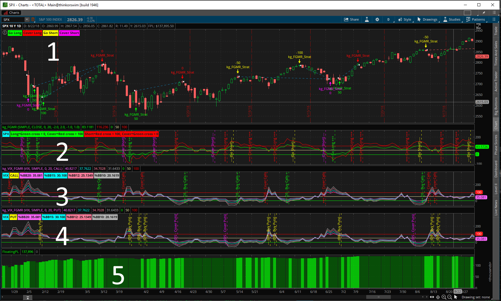
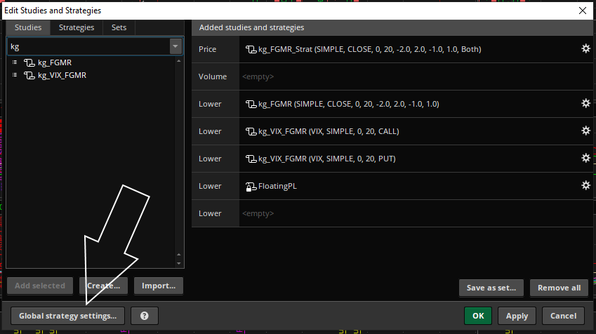
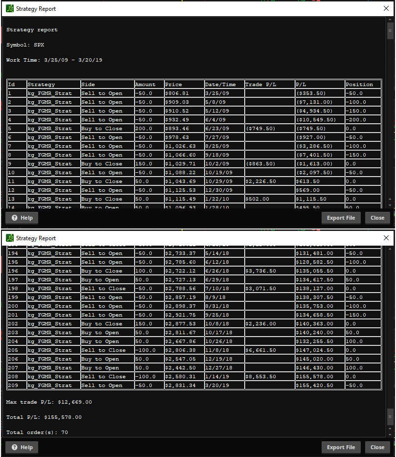

# $SPX Fear & Greed Mean Reversion Strategy (FGMR) #

This is a long/short strategy based on the work of [@kerberos007](https://twitter.com/kerberos007). If you look at his feed, you will see lots of work regarding this strategy using Bollinger Bands, Percent B (%B), and some initial parameters that give good back testing results.

As with any strategy, you should understand it, tweak it to your own risk profile, and extend it to incorporate other indicators and strategies.

Alternatively, just buy or sell the glitch!

## A picture is worth a thousand words, FGMR on SPX ##

### Legend ###

    1 SPX 1D chart with FGMR Strategy
    2 FGMR Study
    3 VIX_FGMR Study for Calls
    4 VIX_FGMR Study for Puts
    5 Floating P&L for the strategy

    Green, go long, buy calls
    Red, cover long, cover calls
    Yellow, go short, buy puts
    Magenta, cover short, cover calls

What is the #2 study doing? Per the aformentioned work from [@kerberos007](https://twitter.com/kerberos007)

    go long when %B(20,1) crosses > 0
    cover long when %B(20,2) crosses > 100
    go short when %B(20,2) crosses < 100
    cover short when %B(20,1) crosses < 0

A *Study* will fire many times more than its corresponding *Strategy*. This is also good for developing a new strategy, so you can eyeball when various conditions happen and you get your aha moment.

The #1 strategy is the strategy version of the #2 study.

The #3 and #4 studies are a variant of the %B indicators used in FGMR. These are not incorporated into the strategy (at least yet). You can use the VIX_FGMR Study for trading the VIX. Check out [VIX_FGMR](/VIX_FGMR/VIX_FGMR.md) for details.

When #3 shows VIX %B overbought and SPX %B is oversold, there's a good chance for bottom in the SPX.

Similarly, when #4 shows VIX %B oversold and SPX %B is overbought, there's a good chance for top in the SPX.

## Strategy and Study Development ##

The thinkscript code for the strategies and studies are below. They are saved as txt files so they can be opened easily. You will need to create a new study or strategy in thinkorswim and copy/paste them in.

[FGMR_Strat](/FGMR/FGMR_Strat.txt)

[FGMR](/FGMR/FGMR.txt)

[VIX_FGMR](/VIX_FGMR/VIX_FGMR.txt)

From the Studies menu on your chart, choose "Edit studies..." and get the following dialog. Configure as shown, and you should have a screen that matches the screen at the top of this page.

I name my studies with my initials to make them easy to find. The arrow shows you where the find the "Global strategy settings...". Using a default trade size of 50 in your "Global strategy settings..." will make the strategy correspond to the dollar value of 1 ES contract.

## Results: Show Report ##

I loaded a 10 year, 1 day chart of SPX, and generated the following report. You can export to csv file for further analysis. You can use excel, python, or PowerShell to further process the data for import stats. To get the report, right-click any trade in the Strategy screen, and choose "Show report".

Here's the csv file I exported from my study: [FGMR-StrategyReports-SPX.csv](/FGMR/FGMR-StrategyReports-SPX.csv)

Check out [Trading System Special: Testing Your Strategy](https://tickertape.tdameritrade.com/trading/trading-system-special-testing-your-strategy-15192) for some starting ideas.

## post script ##

These studies may or may not work on other symbols. With modifications to the parameters, maybe they work better for Gold than the Euro. Welcome to technical analysis and your journey down the rabbit hole.

## feedback welcome ##

Have a suggestion? Found an issue? Reach out to me on twitter, my DM is open to all. If you are a github user, file an issue or make a suggested change and PR to this repo.

---
back to [README.md](/README.md)