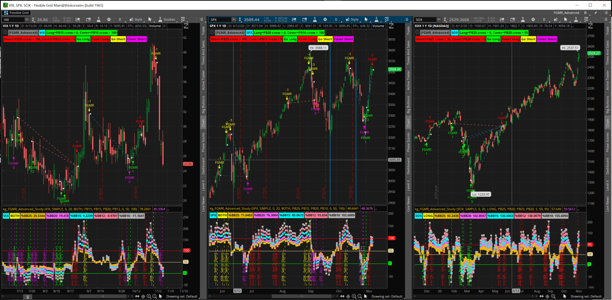

# Fear & Greed Mean Reversion Advanced Strategy (FGMR_ADVANCED) #

FGMR Advananced is an refactored, updated and combined strategy and study that lets you input settings to tune FGMR for a given symbol. You can use FGMR Advanced to replace the original SPX/VIX/SOX studies below. See the other pages here for how the strategy works.

Attribution: This is a long/short strategy based on the work of [@kerberos007](https://twitter.com/kerberos007). If you look at his feed, you will see lots of work regarding this strategy using Bollinger Bands, Percent B (%B), and some initial parameters that give good back testing results.

As with any strategy, you should understand it, tweak it to your own risk profile, and extend it to incorporate other indicators and strategies.

Alternatively, just buy or sell the glitch!

## A picture is worth a thousand words, FGMR on SPX/VIX/SOX ##

You can load this Flexible Grid into your TOS by using Setup | Open Shared Item and pasting in this link: http://tos.mx/fkoZb7i

## CODE ##

[FGMR_ADVANCED_Strategy](/FGMR_ADVANCED/FGMR_ADVANCED_Strategy.txt)

[FGMR_ADVANCED_Study](/FGMR_ADVANCED/FGMR_ADVANCED_Study.txt)

I name my studies with my initials to make them easy to find. The arrow shows you where the find the "Global strategy settings...". Using a default trade size of 50 in your "Global strategy settings..." will make the strategy correspond to the dollar value of 1 ES contract.

## post script ##

These studies may or may not work on other symbols. With modifications to the parameters, maybe they work better for Gold than the Euro. Welcome to technical analysis and your journey down the rabbit hole.

## feedback welcome ##

Have a suggestion? Found an issue? Reach out to me on twitter, my DM is open to all. If you are a github user, file an issue or make a suggested change and PR to this repo.

---
back to [README.md](/README.md)