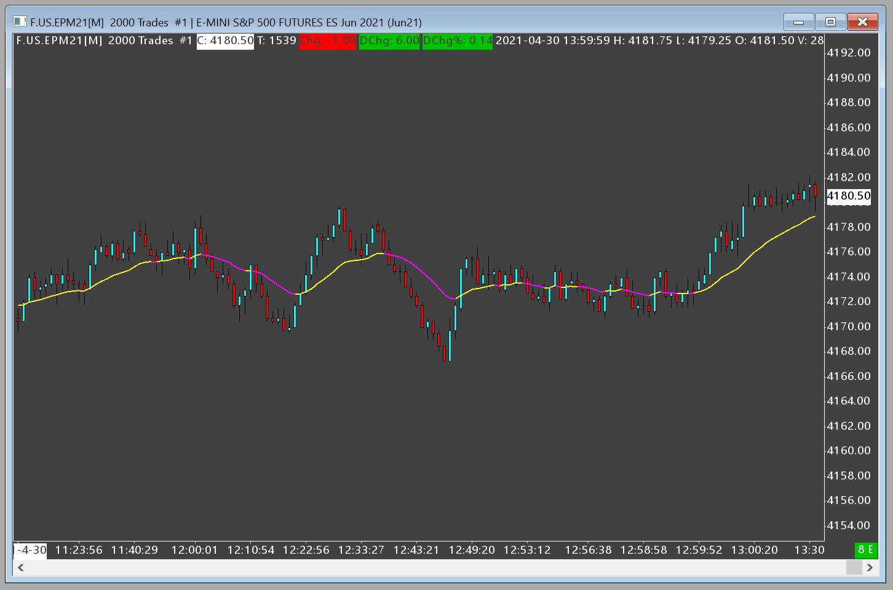

# Sierra Chart strategies and studies #

## New Study Template ##

The *New Study Template* in [kg_NewStudyTemplate.cpp](/SIERRA_CHART/kg_NewStudyTemplate.cpp) is a great starting point for any new Sierra Chart study and has some useful helper functions to allow some easy control over your study like Expiration Date, Authorization to specific users, and Authorization to specific users if your study is distributed via the Sierra Chart website Studies Account Control Panel.

The study shows an Exponential Moving Average and makes use of bar coloring if average is over/under price.

## YouTube video where I walk through the code. ##

https://youtu.be/enUPbJpHtvU

---
back to [README.md](/README.md)